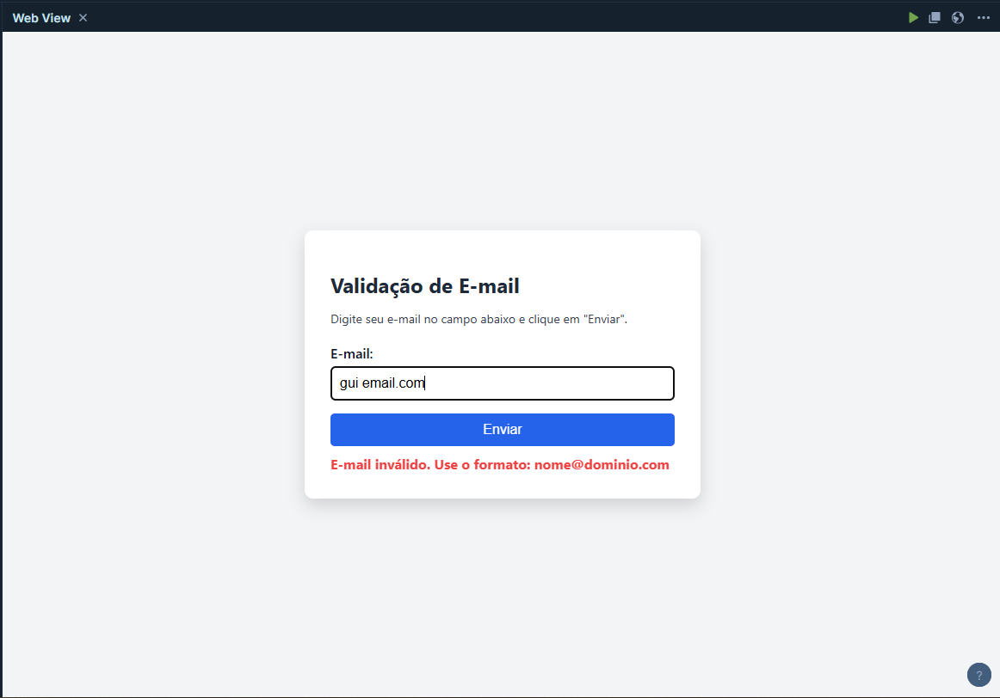

# Validador de E-mail com JavaScript

Este projeto é uma atividade prática da disciplina **Desenvolvimento em JavaScript**, que consiste na criação de um formulário em HTML com validação de campo de e-mail usando **JavaScript puro**. A aplicação é executada em ambiente web, com foco na prática de manipulação do DOM, tratamento de eventos e validação de entradas do usuário.

## Objetivo

Validar o campo de e-mail digitado pelo usuário em um formulário simples, exibindo mensagens de erro ou sucesso de forma clara e visualmente acessível.

## Tecnologias Utilizadas

- HTML5
- CSS3
- JavaScript
- [Playcode.io](https://playcode.io) (ambiente online de desenvolvimento)


## Estrutura do Projeto

```
/
├── index.html
└── src/
    ├── style.css
    └── script.js
```

- `index.html`: Estrutura principal da página.
- `style.css`: Estilização da interface com foco em legibilidade e contraste.
- `script.js`: Validação de e-mail com mensagens de feedback ao usuário.


## Como Executar

1. Acesse o [Playcode.io](https://playcode.io)
2. Crie um novo projeto vazio.
3. Crie uma pasta `src` e adicione os arquivos `style.css` e `script.js` nela.
4. Copie o conteúdo do `index.html` para o arquivo raiz.
5. Execute e teste o formulário com diferentes entradas de e-mail.

## Funcionalidades

- Verificação de e-mail válido usando expressão regular (Regex)
- Mensagens de sucesso e erro com cores diferentes
- Layout responsivo, com interface centralizada e moderna

## Exemplos de Execução

Tela Inicial:


E-mail Inválido:



E-mail Válido:


## Aprendizados

- Uso de eventos em JavaScript (`submit`)
- Manipulação de DOM (`getElementById`, `className`)
- Expressões regulares para validação
- Separação de responsabilidades entre HTML, CSS e JS


## Licença

Este projeto está licenciado sob a licença **MIT**.
